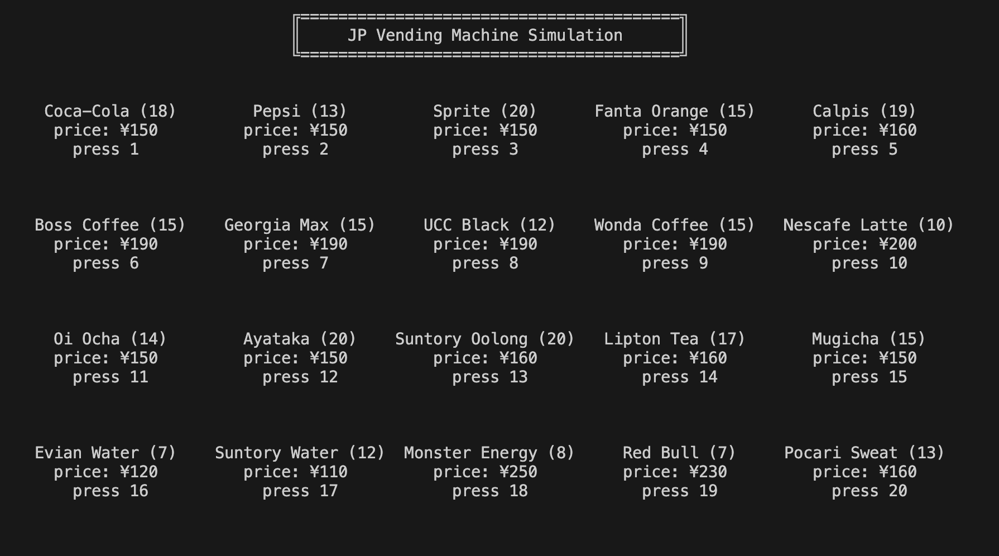
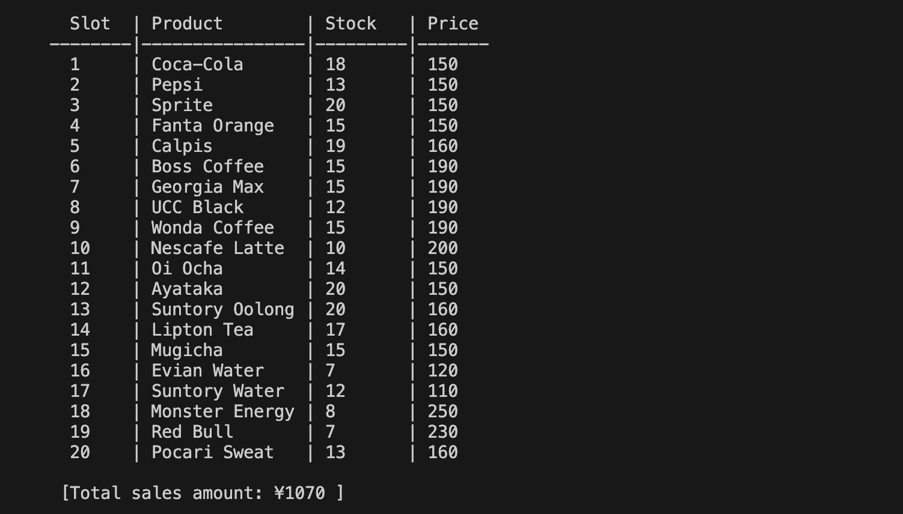
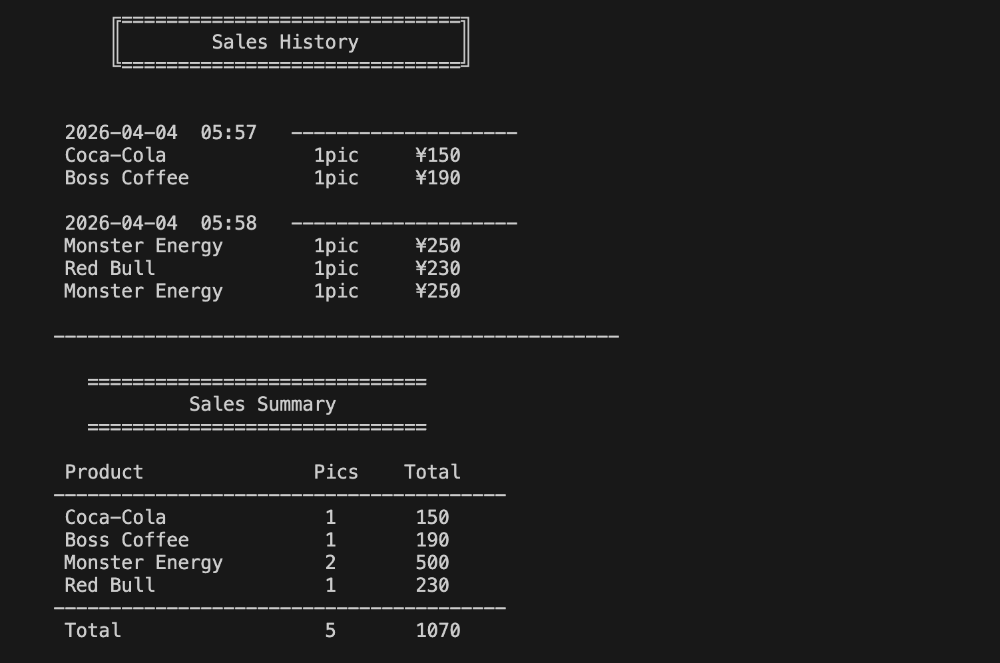

# 🥤 JP Vending Machine Simulation (Python OOP)


Welcome to my Vending Machine project! This is an advanced command-line simulation of a Japanese Vending Machine. This project demonstrates **Object-Oriented Programming (OOP)**, **Complex State Transitions**, and **Secure Administrative Logic**.

---

## 📑 Table of Contents (目次)

1. [English Version](#english-version)
    * [Project Overview](#project-overview)
    * [System Features](#system-features)
    * [Technical Deep Dive](#technical-deep-dive)
    * [Future Roadmap](#future-roadmap)
2. [Japanese Version (日本語版)](#japanese-version-日本語版)
    * [プロジェクト概要](#プロジェクト概要)
    * [主な機能](#主な機能)
    * [技術的なこだわり](#技術的なこだわり)
    * [今後の予定](#今後の予定)
3. [🖼️ Visuals & Screenshots](#visuals--screenshots)
4. [🚀 Installation & Usage](#installation--usage)
5. [🍱 Language Support](#language-support)
6. [✍️ Author's Profile](#authors-profile)

---

# 🇺🇸 English Version

## 📌 Project Overview
This project replicates the intricate logic of Japanese vending machines. Unlike simple "select-buy" scripts, I focused on making the interaction as realistic as possible--including **Inventory Management**, **Multiple Payment Methods** and a secure **Owner Panel**. I developed this to master Python's class composition and handle real-world business constraints.

## ✨ System Features
### 1. Realistic Shopping Flow (Customer)
* **Categorized 4x5 Grid:** Products are organized into Soft Drinks, Coffee, Tea, and Water/Energy.
* **Smart Inventory:** Real-time stock tracking. Items automatically show "Out of Stock" when empty.
* **Multi-Gateway Payment:** * **Cash:** Calculates and returns change.
    * **IC Card:** Simulates Suica/PASMO balance validation.
    * **Credit Card:** High-security mock transaction.
* **Navigation Logic:** Users can backtrack to change payment methods or re-select products mid-transaction.

### 2. Secure Owner Panel (Administrative)
* **Security Lock:** Access is strictly locked after 5 failed login attempts (Security-First 🛡️).
* **Inventory Control:** Owners can restock items (max 20 per slot) and update prices.
* **Sales Analytics:** Generates logs with timestamps and automated revenue summary.

## 🛠️ Technical Deep Dive
* **Composition Pattern:** Used modular classes (`Owner`, `Customer`, `Payment`, `Product`) to keep the system decoupled and scalable.
* **Grammar UI Logic:** Implemented specific conditional logic for **"1 bottle"** vs **"2 bottles"** to ensure linguistic accuracy.
* **State Management:** Handling "Back" and "Change" buttons in a terminal-based loop was challenging, but I managed it using specific return states (`begin`, `change`).

---

# 🇯🇵 Japanese Version (日本語版)

## 📌 プロジェクト概要
このプロジェクトは、日本の自動販売機の動作を精密に再現したシミュレーターです。オブジェクト指向プログラミング（OOP）を活用し、在庫管理や多彩な決済システム、管理者用セキュリティパネルを実装しました。

## ✨ 主な機能
### 1. リアルな購入フロー（利用者）
* **4行5列のカテゴリー表示:** 20種類の商品をカテゴリー別に4行5列のレイアウトで表示。
* **在庫管理:** リアルタイムで在庫を追跡し、在庫切れの際は自動でお知らせ。
* **多様な決済:** 現金、ICカード（Suica/PASMO形式）、クレジットカードに対応。
* **柔軟な操作:** 支払い途中でも、商品選択に戻ったり決済方法を変更したりすることが可能。

### 2. 管理者用パネル（オーナー）
* **セキュリティロック:** 認証に5回失敗すると、管理者機能が自動的にロックされます。
* **在庫・価格設定:** 各商品の在庫補充（最大20個まで）や価格改定が可能です。
* **売上分析:** タイムスタンプ付きの販売履歴と、商品ごとの集計レポートを出力。

## 🛠️ 技術的なこだわり
* **クラス設計:** 保守性を高めるため、複数の独立したクラスを統合する「合成（Composition）」を採用。
* **UXの向上:** 英語の単数形（1 bottle）と複数形（2 bottles）を正確に表示分けるなど、細部の正確さにこだわりました。
* **状態遷移:** `begin`や`change`といった状態管理用の戻り値を利用し、複雑なネスト構造を安全に制御。

---

# 🖼️ Visuals & Screenshots

### 1. Product Display UI (商品一覧画面)
*Main product grid showing names, prices, and stock status.*  
 

### 2. Inventory Management (在庫管理画面)
*Owner view for monitoring real-time inventory and total sales.*  
 

### 3. Sales History & Summary (売上履歴と集計)
*Detailed sales logs and product-wise revenue aggregation.*  
 

---

## 🚀 Installation & Usage (実行方法)

1. **Prerequisites:** Ensure you have **Python 3.x** installed.
2. **Setup:**
   ```bash
   git clone https://github.com/hossain-sarwar/vending-machine-simulation.git
   cd vending-machine-simulation

---

## ✍️ Author's Note (開発者より)

I am **Hossain Sarwar (ホサイン サルワル)**, a Final Year CSE student at **Soka University, Japan**. I am deeply passionate about **Software & Backend Development**, **AI & ML** and **System Design**. 

Building this project helped me master  data flow management and robust error handling in Python. I always strive to write clean, maintainable code that solves real-world problems. If you have any feedback or want to collaborate, feel free to reach out!

### 🎓 Profile Details (プロフィール)
* **University:** Soka University, Japan (Final Year CSE) / 創価大学 工学部 情報システム工学科
* **GitHub:** [hossain-sarwar](https://github.com/hossain-sarwar)
* **Location:** Tachikawa, Tokyo, Japan

### 🚀 Technical Interests (興味・関心)
* **Software & Backend Development** (Python, Javascript, C, Java, Node.js)
* **System Design & Architecture**
* **AI & Machine Learning**
* **Data Science**


